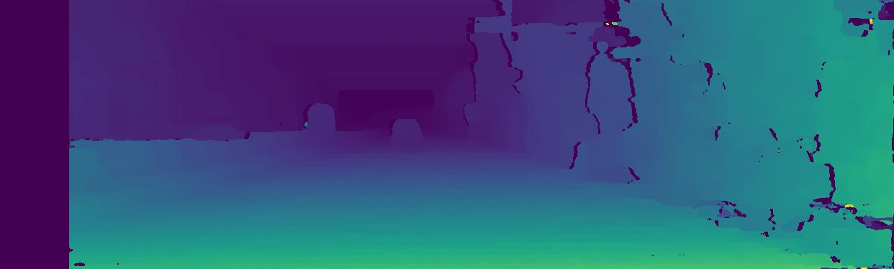
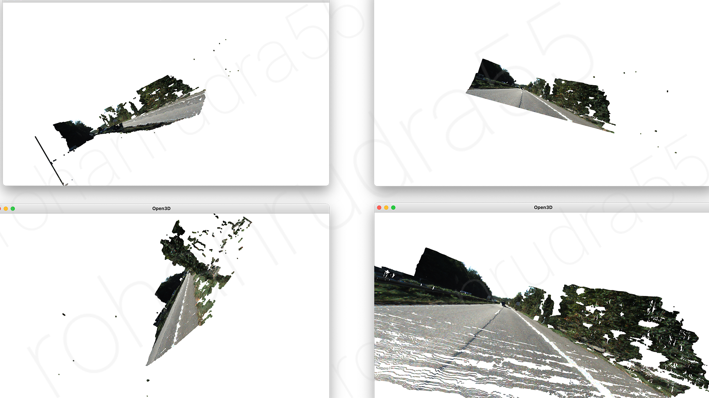

# Depth Estimation

Depth estimation from stereo images using disparity calculation algorithms.

## Python Version

### Requirements

- Python version 3.8
- Install python modules via requirements.txt

```bash
pip install -r requirements.txt
```

### Usage

For features check help

```bash
python3 run.py --h
```
---
## Results
Disparity Map</img>
3D Visualization</img>